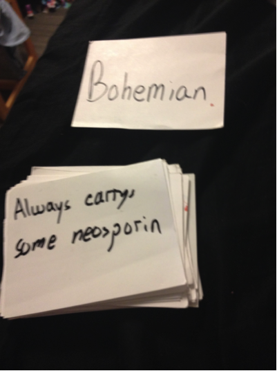
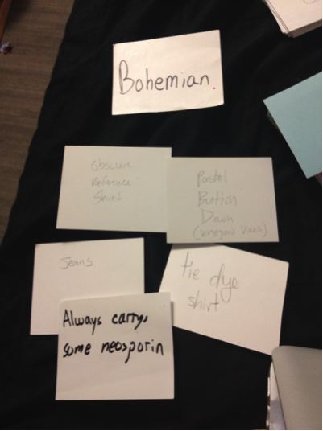
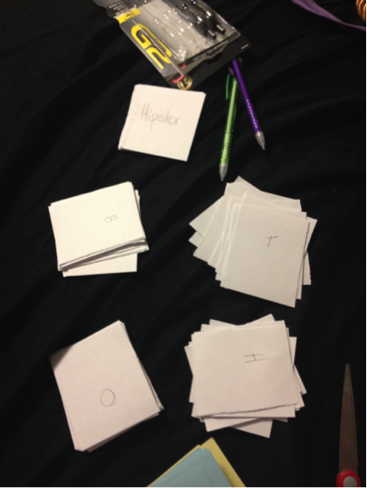
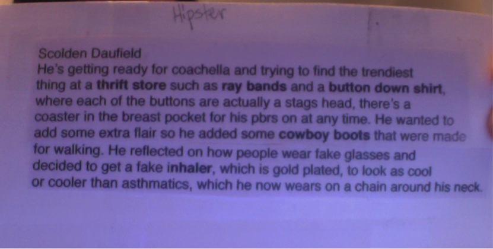

#Stylez
##Kathryn, Michael, Austin

**Iteration 1**
	
 

	
	This game started with two decks of cards: one with a theme and another with style cards. 
	There would be one judge each round and the other players would each draw 5 cards 
	from the style deck. The players were then given 1 minute to make up a character
	that incorporated everything on the cards fit the overall theme. The judge would 
	then choose who they thought did the best job and would award them a point. 
	The role of judge would go around the players clockwise.  The first person to 
	five points wins (point total could change based on how long you wanted to play). 



**Iteration 2**



	Because there was initially only one large deck that the players drew from a potential hand 
	could be just draw five different shirts. We decided to remedy this by making separate 
	decks (one for tops, things that would go on their head, bottoms, and one for lifestyle choices) 
	and each person draws one from each clothing article pile and two from the lifestyle pile. 
	This ensures that they will get a variety of cards for different aspects of their character. 



	When we initially played we gave a minute time to come up with the character. 
	We have since shortener it to 30 seconds because we found the improv aspect of it was 
	more fun, and originally everyone was done before time was called and got bored. 

	We’ve also changed the point system so instead of having a single judge per round. 
	There are potentially 2 points to be earned each round, one from the judge and one 
	from the other players. All of the players get to choose who their favorite was that 
	round (they can’t vote for themselves) and if a majority is reached that player gets 
	a bonus point. If there is no majority just the judges point will be awarded. 
	This will make the points more balanced if judges play favorites.

**Iteration 3**



	After playtesting with these changes the main feedback we got was to add more structure. 
	Players wanted examples of how to make up a character and suggestions for things they could 
	potentially include before going for the first time. 

	We wrote out an instruction card with an example and a list of things that can be 
	included as a result to show people before they play. Our main concern was making sure 
	that the only thing that is mandatory in coming up with the character is using the cards, 
	and not making a checklist for people to fill out in limited time. 

##Play


	
	###Materials
	
		1. Stylez Cards (theme deck and style decks)
	
		2. Timer
	
		3. Instruction/Example Card
	


	###Setup
	
		1. Place theme deck face down
	
		2. Separate style decks in head, tops, bottoms, and lifestyle also face down
	
		3. Set time for one minute


	
	###How to Play
	
		1. Decide who will judge go first (could be oldest)
	
		2. Have the other players draw one card from head, tops, and bottoms, and
 two from lifestyle
	
		3. The judge flips the theme card and starts the the timer for 1 minute
	
		4. Once the one minute is up the person to the left of the judge goes presents their character first
	
		5. The judge gives one point to the winner
	
		6. The players vote for their favorite. If there is a majority  that player gets 
		a point, if there isn’t no extra point is given.
	
		7. Put the cards in the discard and the person to the left becomes the judge.
	
		8. First person to 10 points wins. 